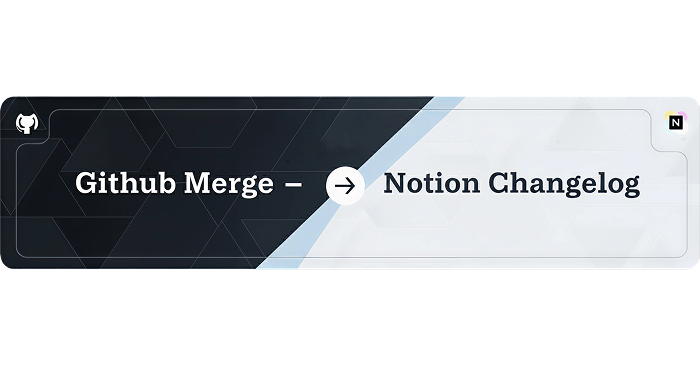
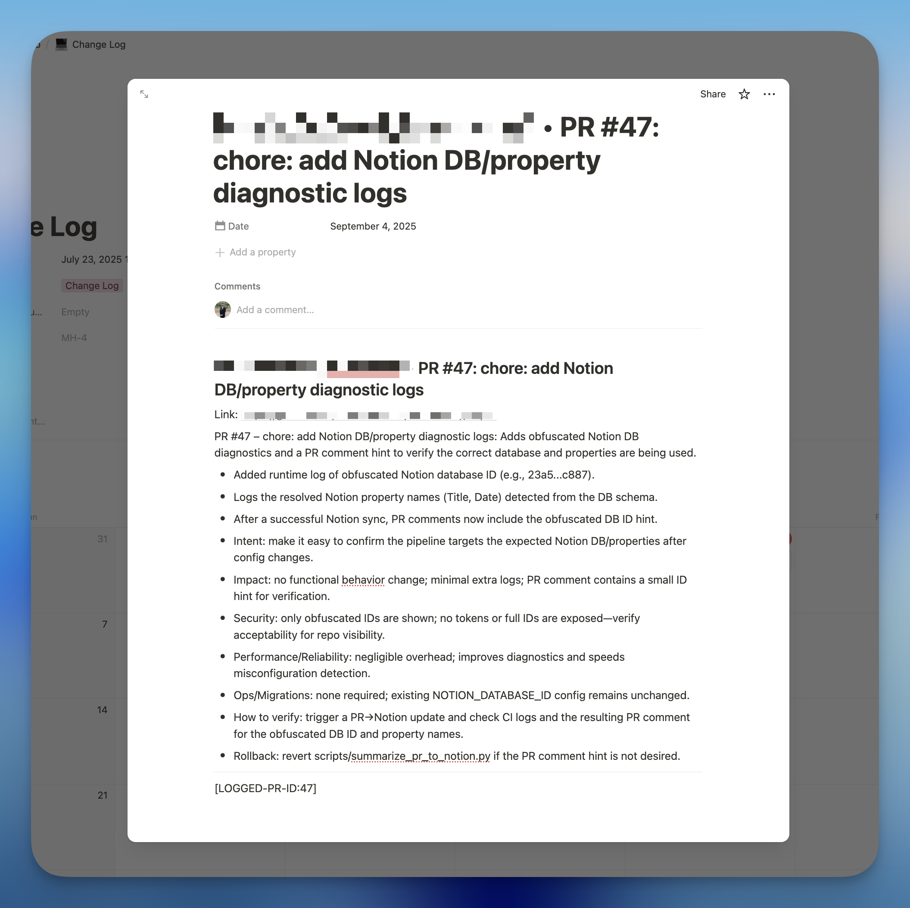
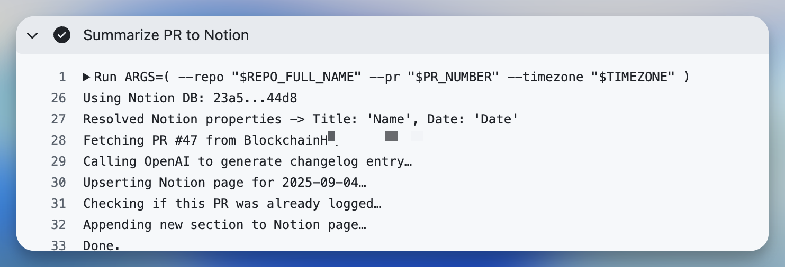
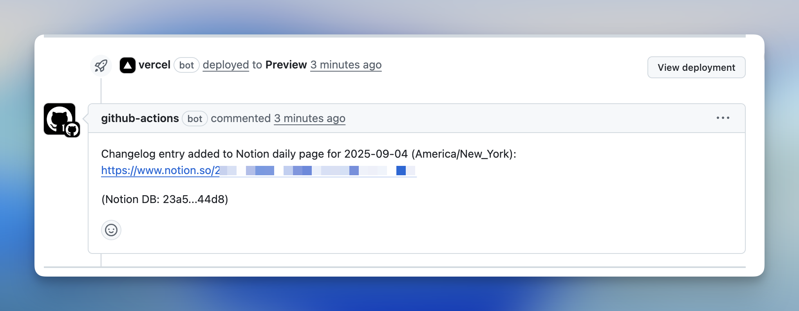

<p align="center">
  
</p>

<h1 align="center">
  GitHub → Notion Changelog
</h1>

<p align="center">
  <i>Turn merged PRs into a polished daily Notion changelog — powered by GPT.</i>
</p>

<h4 align="center">
  <a href="https://github.com/BlockchainHB/github-merge-notion-agent/releases">
    
  </a>
  <a href="LICENSE">
    
  </a>
  <a href="https://github.com/marketplace/actions">
    
  </a>
  <br/>
  <a href="#quick-start">
    
  </a>
  <a href="#demo">
    
  </a>
  <a href="#inputs">
    
  </a>
</h4>

<p align="center">
  
</p>

<p align="center">
  Every merged pull request becomes a clean, AI‑summarized Notion entry. Grouped by day, timezone‑aware, schema‑aware, and auto‑linked back to your PR.
</p>

## Why Use This
- ✨ Zero effort changelogs — every merge gets logged.
- 🧠 GPT summaries that stay concise & actionable.
- 📅 Daily pages (configurable timezone).
- 🔄 Idempotent — no duplicate entries.
- 🔗 PRs auto‑commented with Notion links.
- 🗂 Schema‑aware — auto‑detects Title/Date props.

<p align="center">
  <a href="https://openai.com/"></a>
  <a href="https://www.notion.so/"></a>
</p>

## Demo
<a name="demo"></a>

<p align="center">
  
</p>

<p align="center">
  
</p>

## Quick Start
<a name="quick-start"></a>
Requirements:
- Notion integration: create one and invite it to your target database.
- Notion database: has a Date property (e.g., `Date`) and a Title property (e.g., `Title`).
- Repository secrets:
  - `NOTION_TOKEN`
  - `NOTION_DATABASE_ID`
  - `OPENAI_API_KEY`

Add this workflow to your repo (runs on merged PRs and supports manual runs):

```yaml
name: PR → Notion Changelog

on:
  pull_request:
    types: [closed]
  workflow_dispatch:
    inputs:
      pr_number:
        description: "PR number to summarize (for manual runs)"
        required: false
      date_override:
        description: "Optional date (YYYY-MM-DD)"
        required: false

permissions:
  contents: read
  pull-requests: write
  issues: write

jobs:
  changelog:
    if: >-
      ${{ (github.event_name == 'pull_request' && github.event.pull_request.merged == true) ||
          (github.event_name == 'workflow_dispatch') }}
    runs-on: ubuntu-latest
    steps:
      - uses: actions/checkout@v4
      - name: PR → Notion Changelog
        uses: BlockchainHB/github-merge-notion-agent@v1
        with:
          timezone: America/New_York
          date_property: Date
          title_property: Title
          llm_model: gpt-4o
        env:
          NOTION_TOKEN: ${{ secrets.NOTION_TOKEN }}
          NOTION_DATABASE_ID: ${{ secrets.NOTION_DATABASE_ID }}
          OPENAI_API_KEY: ${{ secrets.OPENAI_API_KEY }}
          GITHUB_TOKEN: ${{ secrets.GITHUB_TOKEN }}
```

## Developer Setup
- Clone this repo and edit `scripts/` or `action.yml`.
- Local run (optional): execute the script with env vars set (`NOTION_TOKEN`, `NOTION_DATABASE_ID`, `OPENAI_API_KEY`, `GITHUB_TOKEN`). Use a future `date_override` (e.g., `2099-01-01`) to avoid touching today’s page.
- To test in another repo: point `uses:` to your branch (e.g., `@feature-branch`).

## Contributing
- 🐛 Found a bug? Open an issue with steps + logs (omit secrets).
- 💡 Want a feature? Propose interface + rationale first.
- ✅ Submit small PRs with a quick test plan.
- 🙏 Be kind, concise, and security‑minded (no secrets in logs or examples).

## Inputs
<a name="inputs"></a>
- `timezone`: timezone for daily page buckets (default `America/New_York`)
- `date_property`: Notion Date property name (default `Date`)
- `title_property`: Notion Title property name (default `Title`)
- `llm_model`: OpenAI model ID (default `gpt-4o`)
- `pr_number`: PR number when using manual dispatch
- `date_override`: write into a specific date (YYYY‑MM‑DD) for testing

## Behavior
- Comments on PR: enabled by default; set `COMMENT_ON_PR=false` to disable
- Idempotency: adds a hidden marker `[LOGGED-PR-ID:<number>]` and checks headings to avoid duplicates
- Schema detection: fetches DB schema and auto‑selects the first Title/Date props if names differ

## Troubleshooting
- Notion 400 Bad Request: invite the integration to the database; confirm Date/Title property names or set custom names via inputs
- Model access: ensure your OpenAI key can use the chosen `llm_model`
- Forked PRs: for public repos receiving fork PRs, consider `pull_request_target` with caution (secrets exposure)

## 7) Connect
Developed by Hasaam Bhatti — hasaamb.com · x.com/automatingwork

If this Action helps you ship cleaner changelogs, please star the repo and share it with your team.

## License
MIT — see `LICENSE` for details.
